# Pas a Pas  
## SEGURETAT LÒGICA

---

**Fet per:** Aran Perez

---

## Configuració de la màquina:

Al primer que haurem de fer serà crear una màquina virtual sense res, només posant el nom, la ruta, i configurar-la com a tipus Linux.

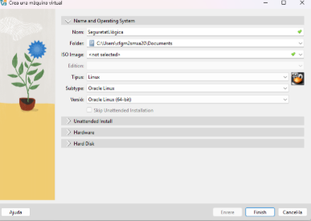

Un cop fet això, anem a **Emmagatzematge** i afegim el disc dur que ens hem descarregat:  
`p02t03-disk1.vmdk`

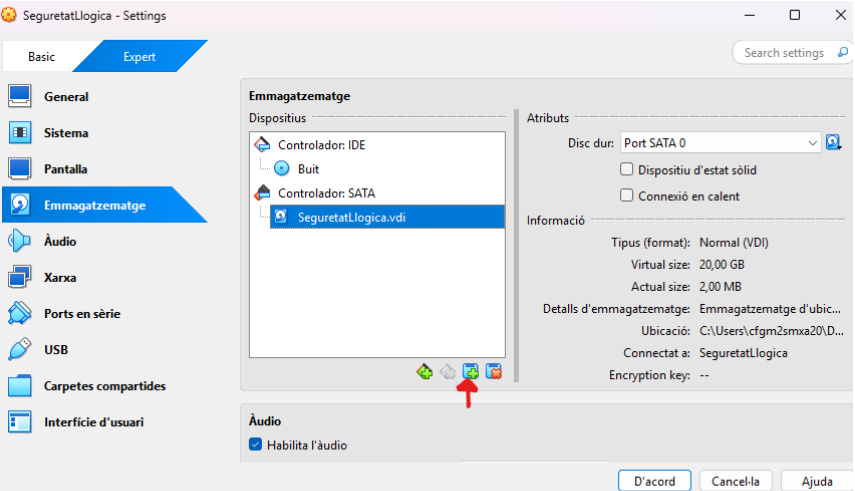

I ara només faltarà configurar la màquina com ens demana.

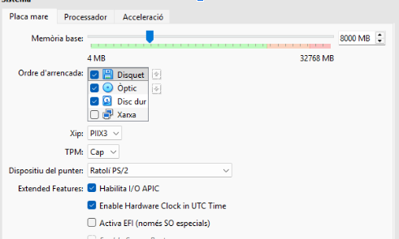

---

## Canviar password:

Ara, un cop arranquem la màquina, hem de mantenir premut **Shift** i una lletra qualsevol.  
Ens sortirà aquesta primera opció: li donarem a **“Advanced options…”**

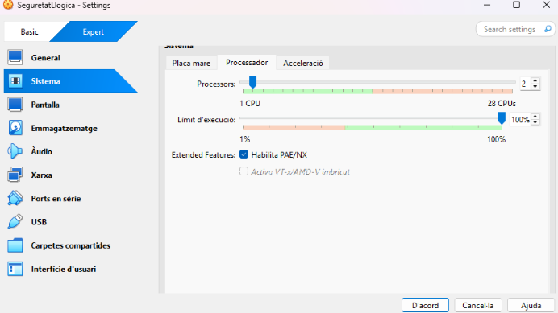

En el següent menú, haurem de donar-li a la segona opció.

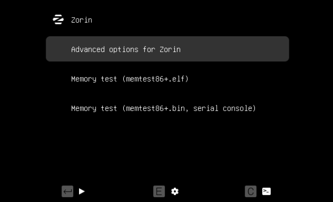

Al menú de recuperació, triarem l'opció **root**.

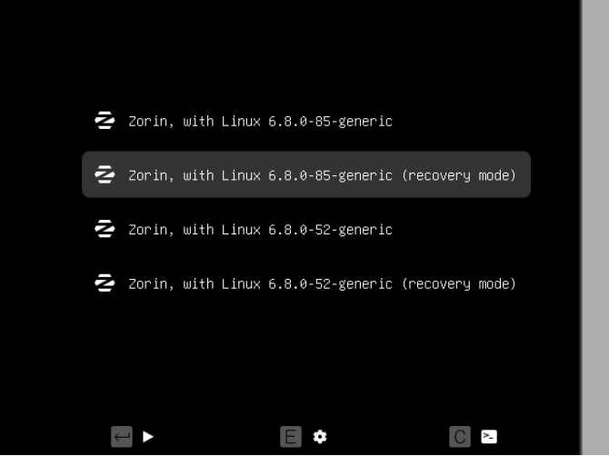

Ara haurem de teclejar la següent comanda:  

(miquel és el nom d'usuari) i posar la nova contrasenya.

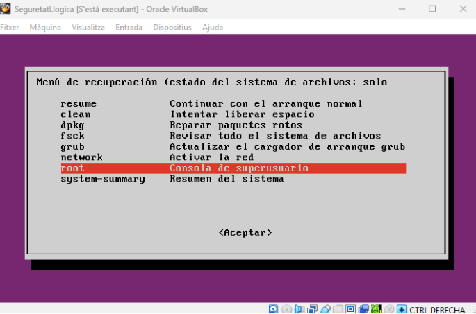

---

## Investigar com es pot fortificar l'accés al GRUB:

Llocs web que m'han ajudat: *link*

Fem un: **sudo -i** per entrar com a root.

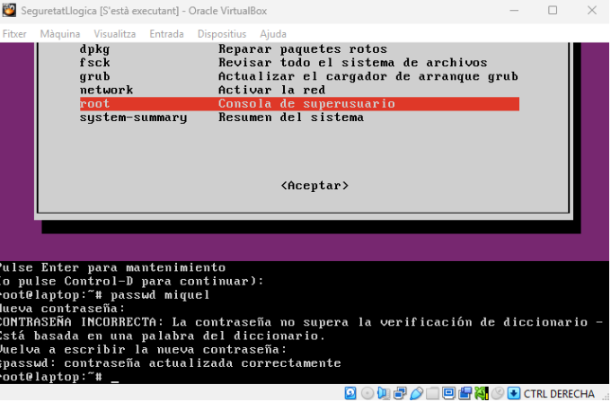

Ara hem instal·lat al GRUB i li hem posat una contrasenya.

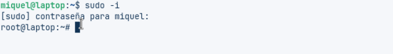

(Ara copiarem tot el hash des de `grub` fins al final)

Ara haurem de posar el nom d'usuari i la contrasenya (la contrasenya serà el hash). Això ho posarem a la ruta: **/etc/grub.d/40_custom**  

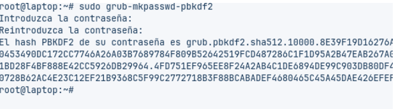

I per acabar farem un **sudo grub-mkconfig -o /boot/grub/grub.cfg** per aplicar els canvis del GRUB.

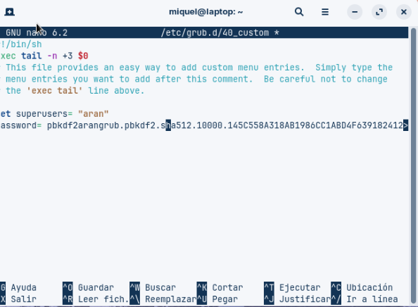

A l'hora d'entrar surt aquest panell.

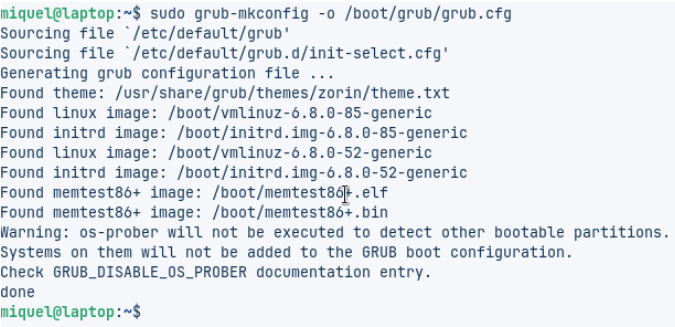

